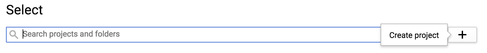
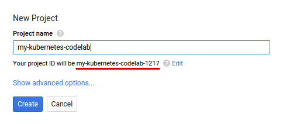
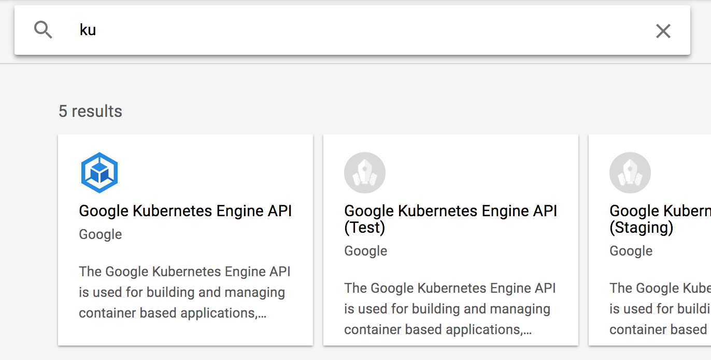
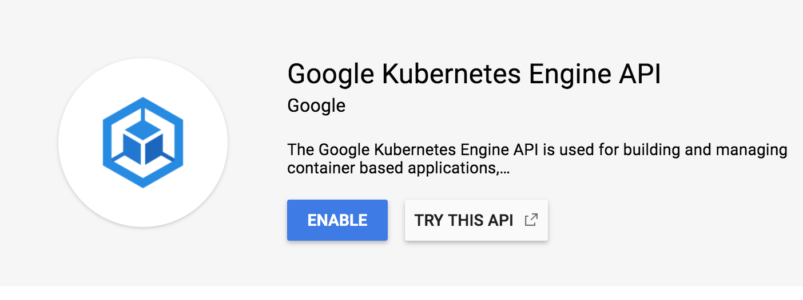
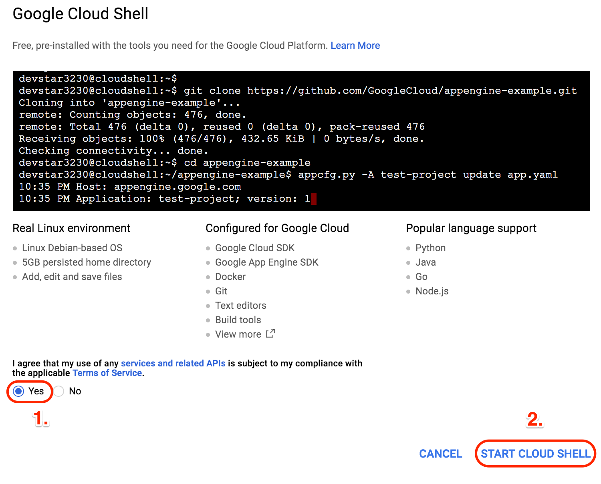
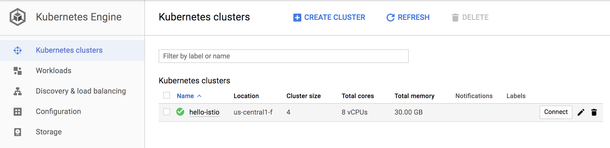
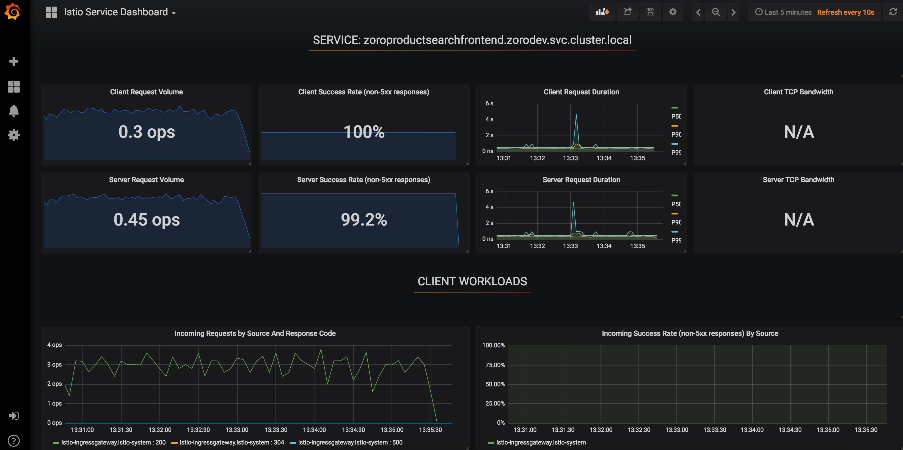
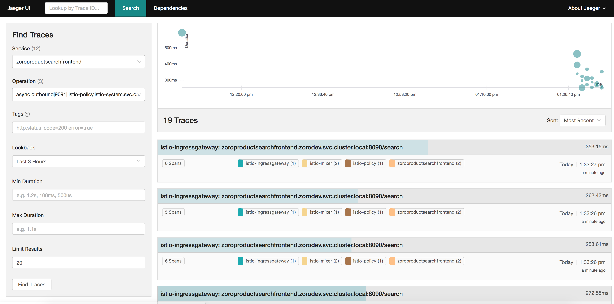

# Istio Service Management and API Management Workshop


## Summary

In this lab, you will learn how to install and configure Istio, an open source framework for connecting, securing, and managing microservices, on Google Kubernetes Engine, Google's hosted Kubernetes product. You will also deploy an Istio-enabled multi-service application. Once you complete this lab, you can try managing APIs with Istio and Apigee Edge.

## Table of Contents

1. [Introduction](#introduction)
2. [Setup and Requirements](#setup-and-requirements)
3. [Prepare your Kubernetes/GKE cluster](#prepare-your-kubernetes-cluster)
4. [Installing Istio](#installing-istio)
5. [Verifying the installation](#verifying-the-installation)
6. [Deploying an application](#deploying-an-application)
7. [Use the application](#use-the-application)
8. Monitoring and Observability
   - [View metrics and tracing](#viewing-metrics-and-tracing)
   - [Monitoring for Istio](#monitoring-for-istio)
9. [Circuit Breaker](#circuit)
12. [Security](#security)
    - [Testing Istio mutual TLS authentication](#mutual)

## Introduction <a name="introduction"/>

[Istio](http://istio.io) is an open source framework for connecting, securing, and managing microservices, including services running on Google Kubernetes Engine (GKE). It lets you create a network of deployed services with load balancing, service-to-service authentication, monitoring, and more, without requiring any changes in service code.

You add Istio support to services by deploying a special Envoy sidecar proxy to each of your application&#39;s pods in your environment that intercepts all network communication between microservices, configured and managed using Istio'&#39;'s control plane functionality.

## Setup and Requirements <a name="setup-and-requirements"/>

If you don&#39;t already have a Google Account (Gmail or Google Apps), you must [create one](https://accounts.google.com/SignUp). Sign-in to Google Cloud Platform console ( [console.cloud.google.com](http://console.cloud.google.com)) and create a new project:
 
 
 

Remember the project ID, a unique name across all Google Cloud projects (the name above has already been taken and will not work for you, sorry!). It will be referred to later in this codelab as PROJECT\_ID.

Next, you&#39;ll need to [enable billing](https://console.cloud.google.com/billing) in the Developers Console in order to use Google Cloud resources.

Running through this codelab shouldn&#39;t cost you more than a few dollars, but it could be more if you decide to use more resources or if you leave them running (see &quot;cleanup&quot; section at the end of this document). Google Kubernetes Engine pricing is documented [here](https://cloud.google.com/kubernetes-engine/docs/#pricing).

New users of Google Cloud Platform are eligible for a [$300 free trial](https://console.developers.google.com/billing/freetrial?hl=en).

### Enable API

Enable the Kubernetes Engine API:
1. First click on APIs and Services on the right pane


2. Check if the Kubernetes APIs are enabled


3. If you **CANNOT** find this in your project, then Kubernetes APIs are not enabled. Proceed further. Otherwise skip the following steps.

4. Click on **ENABLE APIS AND SERVICES**


5. Start typing _**ku**_ in the search bar
 

6. Select _Google Kubernetes Engine API_

7. Enable the API. This step could take 2 or 3 minutes.



### Google Cloud Shell

While Google Cloud and Kubernetes can be operated remotely from your laptop, in this workshop we will be using Google Cloud Shell, a command line environment running in the Cloud.

This Debian-based virtual machine is loaded with all the development tools you'll need. It offers a persistent 5GB home directory, and runs on the Google Cloud, greatly enhancing network performance and authentication. This means that all you will need for this codelab is a browser (yes, it works on a Chromebook).

To activate Google Cloud Shell, from the developer console simply click the button on the top right-hand side (it should only take a few moments to provision and connect to the environment):


Then accept the terms of service and click the "Start Cloud Shell" link:



Once connected to the cloud shell, you should see that you are already authenticated and that the project is already set to your _PROJECT_ID_

## Prepare your Kubernetes/GKE cluster <a name="prepare-your-kubernetes-cluster"/>

The requirements for this Istio lab are as follows:

- your cluster should use Kubernetes 1.9.0 or newer, which includes [role-based access control (RBAC)](https://cloud-dot-devsite.googleplex.com/container-engine/docs/role-based-access-control) support.
- you need to [create your cluster with alpha feature support](https://cloud.google.com/container-engine/docs/alpha-clusters), as Istio makes use of [initializers](https://kubernetes.io/docs/admin/extensible-admission-controllers/#enable-initializers-alpha-feature) to [automatically install the Istio Proxy into every Pod](https://istio.io/docs/setup/kubernetes/sidecar-injection.html#automatic-sidecar-injection)

To create a new cluster that meets these requirements, including alpha features, run the following commands (this assumes that you have correctly set a zone as indicated in the setup) :

```
    gcloud container clusters create hello-istio \
    --machine-type=n1-standard-2 \
    --num-nodes=6 \
    --no-enable-legacy-authorization \
    --zone=us-central1-b \
    --cluster-version=1.10.7-gke.1
```

Setup Kubernetes CLI Content:

```gcloud container clusters get-credentials hello-istio --zone us-central1-b --project PROJECT_ID```

Now, grant cluster admin permissions to the current user. You need these permissions to create the necessary RBAC rules for Istio.

```
    kubectl create clusterrolebinding cluster-admin-binding \
    --clusterrole=cluster-admin \
    --user=$(gcloud config get-value core/account)
```

If you navigate in the GCP console to Kubernetes clusters you should see a screen similar to this:



## Installing Istio <a name="installing-istio"/>

Now, let&#39;s install Istio. Istio is installed in its own Kubernetes istio-system namespace, and can manage microservices from all other namespaces. The installation includes Istio core components, tools, and samples.

The [Istio release page](https://github.com/istio/istio/releases) offers download artifacts for several OSs. In our case, with CloudShell we&#39;ll be using this command to download and extract the latest release automatically:

```curl -L https://git.io/getLatestIstio | sh -```

The installation directory contains the following:

- Installation .yaml files for Kubernetes in **install/**
- Sample applications in **samples/**
- The istioctl client binary in the **bin/** directory. This tool is used when manually injecting Envoy as a sidecar proxy and for creating routing rules and policies.
- The VERSION configuration file

Change to the istio install directory:

```cd ./istio-* ```

Add the istioctl client to your PATH:

```export PATH=$PWD/bin:$PATH```

Let&#39;s now install Istio&#39;s core components. We will install the Istio Auth components which enable [**mutual TLS authentication**](https://istio.io/docs/concepts/security/mutual-tls.html) between sidecars:

1. Create the custome resource definitions
```kubectl apply -f install/kubernetes/helm/istio/templates/crds.yaml```

2. Create the helm service account
```kubectl create -f install/kubernetes/helm/helm-service-account.yaml```

3. Initialize helm
```helm init --service-account tiller```

4. Render Istio’s core components to a Kubernetes manifest called istio.yaml
```helm template install/kubernetes/helm/istio --name istio --set tracing.enabled=true  --set grafana.enabled=true --set kiali.enabled=true --namespace istio-system > $HOME/istio.yaml```
NOTE: See here for details on how to install the [helm client](https://docs.helm.sh/using_helm/).

4. Install the components
```
kubectl create namespace istio-system
kubectl apply -f $HOME/istio.yaml
```
This creates the istio-system namespace along with the required RBAC permissions, and deploys Istio-Pilot, Istio-Mixer, Istio-Ingress, Istio-Egress, and Istio-CA (Certificate Authority).

## Verifying the installation <a name="verifying-the-installation"/>

First, ensure the following Kubernetes services are deployed: istio-pilot, istio-mixer, istio-ingress, and istio-egress.

Run the command:
```
kubectl get svc -n istio-system
```
OUTPUT:

```
NAME            CLUSTER-IP      EXTERNAL-IP       PORT(S)                       AGE
grafana                    ClusterIP      10.35.241.104   <none>           3000/TCP                                                              18m
istio-citadel              ClusterIP      10.35.252.114   <none>           8060/TCP,9093/TCP                                                     18m
istio-egressgateway        ClusterIP      10.35.255.114   <none>           80/TCP,443/TCP                                                        18m
istio-galley               ClusterIP      10.35.240.201   <none>           443/TCP                                                               18m
istio-ingressgateway       LoadBalancer   10.35.247.245   xx.xxx.xxx.xxx   80:31380/TCP,443:31390/TCP,31400:31400/TCP                            18m
istio-pilot                ClusterIP      10.35.243.14    <none>           15003/TCP,15005/TCP,15007/TCP,15010/TCP,15011/TCP,8080/TCP,9093/TCP   18m
istio-policy               ClusterIP      10.35.251.186   <none>           9091/TCP,15004/TCP,9093/TCP                                           18m
istio-sidecar-injector     ClusterIP      10.35.253.208   <none>           443/TCP                                                               18m
istio-statsd-prom-bridge   ClusterIP      10.35.254.35    <none>           9102/TCP,9125/UDP                                                     18m
istio-telemetry            ClusterIP      10.35.254.188   <none>           9091/TCP,15004/TCP,9093/TCP,42422/TCP                                 18m
prometheus                 ClusterIP      10.35.253.203   <none>           9090/TCP                                                              18m
servicegraph               ClusterIP      10.35.250.205   <none>           8088/TCP                                                              18m
tracing                    ClusterIP      10.35.242.39    <none>           80/TCP                                                                18m
zipkin                     ClusterIP      10.35.247.252   <none>           9411/TCP                                                              18m
```

Then make sure that the corresponding Kubernetes pods are deployed and all containers are up and running.

Run the command:
```
kubectl get pods -n istio-system
```
OUTPUT:
```
NAME                                READY     STATUS    RESTARTS   AGE
grafana-69fc7b47bd-v4qm8                   1/1       Running   0          17m
istio-citadel-857cf5dc8c-hkdrm             1/1       Running   0          17m
istio-egressgateway-dbf9c5d7c-87d8s        1/1       Running   0          17m
istio-galley-6496b645bf-khw6b              1/1       Running   0          17m
istio-ingressgateway-596bdb588c-zxprt      1/1       Running   0          17m
istio-pilot-7db88954f4-s26fc               2/2       Running   0          17m
istio-policy-6bb954c589-9fvqk              2/2       Running   0          17m
istio-sidecar-injector-57657b649d-vhlmg    1/1       Running   0          17m
istio-statsd-prom-bridge-59b45fd6d-5n5nd   1/1       Running   0          17m
istio-telemetry-66bd668dfd-6st47           2/2       Running   0          17m
istio-tracing-647f8c48f8-fcznc             1/1       Running   0          17m
prometheus-ffd95f9f6-hz5r4                 1/1       Running   0          17m
servicegraph-78fddd97cb-9blxc              1/1       Running   0          17m
```

When all the pods are running, you can proceed.

## Deploying an application <a name="deploying-an-application"/>


### Overview


### Clone from the following repository (ask asanthan@ to get access to the repo)

gcloud source repos clone https://source.developers.google.com/p/inbound-rune-zoro-poc/r/zoropoc [LOCAL_DIRECTORY]

cd [LOCAL_DIRECTORY]

### Deploy Zoro  App

We deploy our application directly using kubectl create and its regular YAML deployment file. We will inject Envoy containers into your application pods using istioctl:

```kubectl create namespace zorodev istio-injection=enabled```

```kubectl create -f backendservices/k8s/01_zorobackendmicroservices.yaml -n zorodev```

```kubectl create -f frontend/k8s/01_zorofrontendmicroservices.yaml -n zorodev```

Finally, confirm that the application has been deployed correctly by running the following commands:

Run the command:
```
kubectl get services -n zorodev
```
OUTPUT:
```
NAME                        TYPE        CLUSTER-IP      EXTERNAL-IP   PORT(S)    AGE
zoroproductsearch           ClusterIP   10.35.244.205   <none>        8080/TCP   1d
zoroproductsearchfrontend   ClusterIP   10.35.248.19    <none>        8090/TCP   1d
```

### Configure Istio

### Configure to enable the Ingress

```kubectl create -f frontend/k8s/02_zorofrontendvirtualservice.yaml -n zorodev```

```kubectl create -f frontend/k8s/03_zorofrontendsvcgateway.yaml -n zorodev```

### Configure to enable the Egress Traffic out to zorocloud

 ```kubectl create -f backendservices/k8s/istiofiles/01_egress_zorocloud_service_entry.yaml -n zorodev```

 ```kubectl create -f backendservices/k8s/istiofiles/02_egress_gateway.yaml -n zorodev```

 ```kubectl create -f backendservices/k8s/istiofiles/03_zorobackendsvcgateway.yaml -n zorodev```

 ### Testing the Services

 Now that it&#39;s deployed, let&#39;s see the Zoro application in action.

First you need to get the ingress IP and port, as follows:


 ```export GATEWAY_URL=$(kubectl -n istio-system get service istio-ingressgateway -o jsonpath='{.status.loadBalancer.ingress[0].ip}')```

 Check that the BookInfo app is running with curl:

Run the command:
```
curl -o /dev/null -s -w "%{http_code}\n" http://${GATEWAY_URL}/search
```
OUTPUT:
```
200
```

## View metrics and tracing <a name="viewing-metrics-and-tracing"/>

Istio-enabled applications can be configured to collect trace spans using, for instance, the popular [Jaeger](https://www.jaegertracing.io/docs/) distributed tracing system. Distributed tracing lets you see the flow of requests a user makes through your system, and Istio&#39;s model allows this regardless of what language/framework/platform you use to build your application.


Open your browser by clicking http://35.232.1.105/d/LJ_uJAvmk/istio-service-dashboard?refresh=10s&orgId=1&var-service=zoroproductsearchfrontend.zorodev.svc.cluster.local&var-srcns=All&var-srcwl=All&var-dstns=All&var-dstwl=All:



Open your browser by clicking
http://35.239.71.115/search?end=1538080462449000&limit=20&lookback=3h&maxDuration&minDuration&operation=async%20outbound%7C9091%7C%7Cistio-policy.istio-system.svc.cluster.local%20egress&service=zoroproductsearchfrontend&start=1538069662449000



